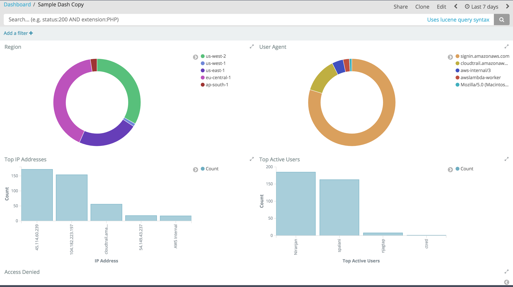
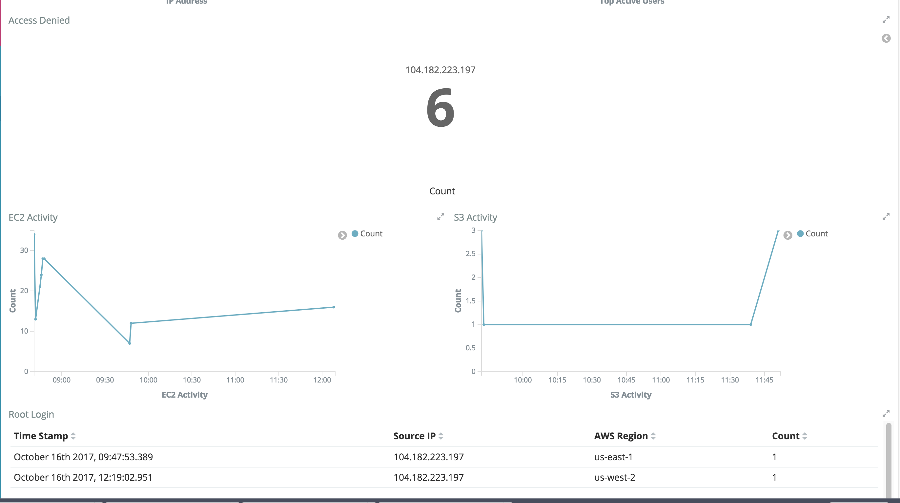

# aws-cloudtrail-kibana

Using AWS Cloudtrail and Elasticsearch and Kibana to create compliance dashboards

## Cloud Trail Setup

* Enable AWS Cloud Trail for global logging to a centaralized s3 bucket
* Create a new cloudwatch log group  for Cloud Trail

## AWS Elasticsearch

Launch an AWS Elasticsearch cluster with the Kibana plugin

## Connect Cloud Trail log to Elasticsearch cluster

Select the Cloud Trail log group to stream to your elasticsearch cluster

## Kibana Setup

* Import everyting using the Export/export.json
* Import ONLY specific vizualizations using Visualize/visualize.json
* Import ONLY the dashboard using Dashboard/dashboards.json 
